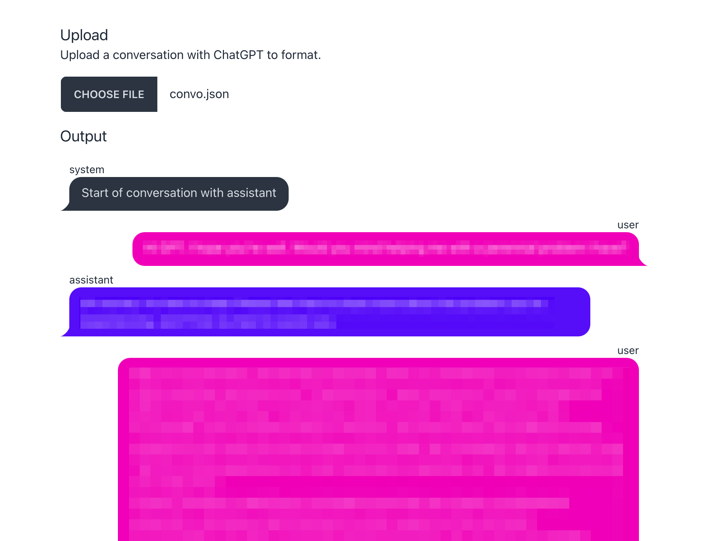

# 💬 convo-formatter — ChatGPT Conversation Formatter

This is a simple browser app that lets you upload a JSON file containing a conversation exported
from **ChatGPT**, and displays it as a formatted conversation à la text messaging.

## Installation

1. Run `yarn install`
2. Follow the instructions to open the app in your browser

## Usage

Upload a JSON file containing a conversation exported from ChatGPT. The app will display the
conversation as a formatted conversation.

### Screenshot

## Contributing

Feel free to submit pull requests to this repository with improvements or fixes.

## License

This project is licensed under the MIT License - see the [LICENSE](LICENSE) file for details.
